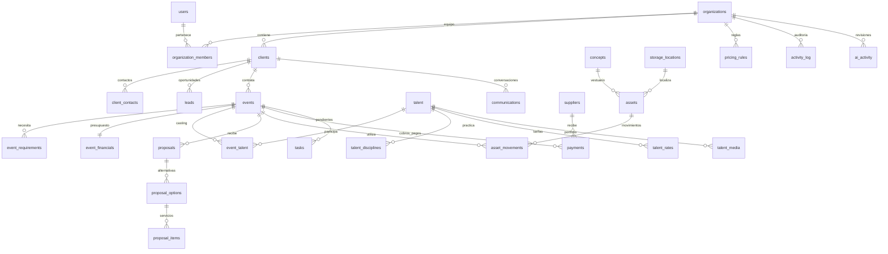

# Performance Lab OS — arquitectura y plan de ejecución

Fecha: 9 septiembre 2026 · Primera entrega: fase 1 · Interfaz: español · Moneda: EUR.

## 1. Arquitectura del sistema

Next.js App Router + React + TypeScript en Vercel. Route Handlers validan cada entrada con Zod y verifican la identidad mediante Supabase Auth. PostgreSQL/Supabase es la única fuente de datos. Cookies para la sesión, sin datos comerciales en localStorage. Supabase Storage privado para archivos en fases posteriores. OpenAI se incorporará exclusivamente desde servidor en fase 3.

El usuario pidió expresamente Next.js, Supabase y Vercel. Se conserva ese stack en lugar del starter Vinext/Cloudflare de Sites. No se sustituye Supabase por un almacenamiento local ni se publica en otro proveedor sin necesidad.

Flujo: navegador → sesión verificada en servidor → validación y autorización → cliente Supabase con la sesión del usuario → RLS PostgreSQL → registro de actividad. No se utiliza service_role en el tráfico normal ni se necesita esa clave para la fase 1.

Separación: presentación en components; dominios, reglas y esquemas en lib; acceso a datos en lib/server; autenticación en lib/supabase; endpoints en app/api; migraciones en supabase/migrations. No existe un objeto JSON único que actúe como base de datos.

Organizaciones aíslan datos entre empresas. Roles por pertenencia: admin, producer, sales y wardrobe. Las claves foráneas compuestas (organization_id, id) impiden referencias entre organizaciones incluso mediante acceso directo a la API de Supabase. Los importes sensibles viven en tablas financieras con sus propias políticas.

## 2. Modelo entidad-relación



## 3. Esquema completo de base de datos

La migración `supabase/migrations/202609090001_initial.sql` es el contrato ejecutable: tablas, campos, tipos, claves, checks, índices, RLS, funciones y triggers. Incluye las cuatro fases del modelo; solo se habilitan las pantallas implementadas. Las tablas de negocio incluyen UUID, organization_id, created_at, updated_at y deleted_at cuando corresponda. Todos los importes se expresan en céntimos enteros; IVA y probabilidad, como porcentaje. Fechas civiles separadas de instantes con zona horaria. Notas y comunicaciones no se exponen fuera de su organización.

## 4. Arquitectura de información

- Mi día: resumen calculado a partir de registros reales; sin KPIs ficticios.
- Comercial: clientes; pipeline con las trece etapas; presupuestos.
- Producción: eventos; talento; tareas.
- Próximas fases: conceptos, vestuario, proveedores, pagos, archivos y LAB AGENT. Se muestra su estado de planificación, sin simular capacidades activas.
- Ajustes: organización, equipo, permisos, reglas de precios y estado de conexiones.
- Búsqueda global: clientes, eventos, talento, leads, tareas y propuestas. Búsquedas independientes por dominio y autorización.

## 5. Flujos de usuario y contrato de cada módulo

### Acceso
Esquema: users → organization_members → organizations. Flujo: conexión de Supabase → acceso con correo y contraseña → primer administrador crea la organización → panel. Interfaz: acceso, recuperación de contraseña, bienvenida y ajustes. Seguridad: nunca deducir el rol de campos editables del perfil; invitaciones a miembros por correo preautorizado, aceptadas al iniciar sesión. Pruebas: aislamiento, bootstrap, cambio de rol y entradas inválidas.

### Clientes y pipeline
Esquema: clients → client_contacts; clients → leads. Flujo: crear cliente, completar contacto y próxima acción, añadir oportunidad, mover etapa, consultar vínculos. Interfaz: tabla filtrable, detalle lateral, formulario y kanban con selector accesible como alternativa a arrastrar. Pruebas: validación de correo, etapas, límites, permisos y relaciones cruzadas.

### Eventos
Esquema: events → requirements, financials, talent, tasks y proposals. Flujo: cliente → brief → fecha/lugar → responsable → requisitos y costes → seguimiento. Interfaz: tarjetas con fecha y salud, detalle y edición. Salud roja si hay requisito crítico sin resolver o tarea vencida; ámbar con datos esenciales o requisitos pendientes; verde al completar. La ausencia de casting/depósito/timing se modela con requisitos explícitos al crear. Cancelados/completados salen de próximos eventos. Pruebas: fechas, transiciones y salud.

### Talento
Esquema: talent → disciplines, rates, media; event_talent une eventos. Flujo: alta → disciplina/ciudad/contacto → tarifas coste/venta → campos de disponibilidad → completitud → asignación. Interfaz: fichas, búsqueda y filtros de disciplina/ciudad/completitud; edición lateral. La completitud depende de campos presentes, no de números inventados. Pruebas: importe, campos falsos válidos, filtros y relaciones.

### Tareas
Esquema: tasks con enlaces independientes por FK a cliente/evento/talento/propuesta/asset/payment. Flujo: crear → asignar → fecha/prioridad → completar/reabrir. Interfaz: lista filtrable y formulario. Automatización inicial: crear pendientes de producción cuando se confirma un evento, una vez por evento; no enviar mensajes. Pruebas: idempotencia, límites de acceso y vínculos.

### Propuestas
Esquema: proposal → options → items. Flujo: cliente/evento → hasta tres opciones → líneas con cantidad/coste/precio/extras → total/IVA/margen → guardar transaccionalmente → PDF → marcar estado. Interfaz: editor con resumen de precios en directo, lista y detalle. El servidor calcula los totales y selecciona explícitamente campos públicos para el PDF; nunca serializa objetos internos al generador. Pruebas: redondeo, opciones, cantidad, acceso y ausencia de costes/margen en PDF.

## 6. Pantallas

`/` Mi día; `/clients` clientes; `/leads` pipeline; `/events` eventos; `/talent` talento; `/tasks` tareas; `/proposals` propuestas; `/settings` configuración y equipo; `/login` acceso; `/setup` estado de conexión; `/onboarding` organización; `/auth/update-password` nueva contraseña. Las rutas futuras explican la fase correspondiente y no permiten operaciones ficticias.

## 7. Plan de MVP y criterios de aceptación

1. Modelo completo, validación, RLS y pruebas de aislamiento.
2. Acceso real y creación de organización. Sin registro público automático de empleados.
3. Panel, clientes y pipeline persistentes; altas, edición y archivado.
4. Eventos con requisitos, casting y salud; talento con completitud.
5. Tareas enlazadas, finalización y pendientes automáticos de producción.
6. Propuestas con A/B/C, cálculos y PDF seguro; reglas de precios editables por admin.
7. Importación CSV de clientes y talento con vista previa, validación y límite de lote; Excel se realizará en fase 2.
8. Pruebas unitarias y PostgreSQL de seguridad, compilación de producción. Pruebas contra Supabase desplegado y publicación Vercel requieren conectar las cuentas. No presentar el sistema como puesto en producción hasta completar ese paso.

Fase 2: conceptos/vestuario/proveedores/pagos/archivos, check-in/out transaccional, conflictos de reserva, Excel y filtros avanzados.
Fase 3: LAB AGENT con salidas estructuradas, recuperación autorizada de registros, actividad AI, revisión y acciones explícitas. No inventar talento ni tarifas, y no ejecutar instrucciones de mensajes pegados.
Fase 4: Gmail y WhatsApp Business oficiales, borradores, automatizaciones y analítica. Mensajes externos solo con autorización explícita; deduplicación por id de proveedor, reintentos y auditoría. Integraciones opt-in.

## 8. Estructura de repositorio

```text
app/                       rutas, autenticación y endpoints
  api/                     CRM, propuestas/PDF, importación, equipo
components/                shell, tablas, formularios, fichas, editor
lib/                       dominios, cálculo, validación y permisos
  server/                  repositorio y contexto autenticado
  supabase/                cliente SSR y renovación de sesión
supabase/migrations/       contrato PostgreSQL y políticas RLS
tests/                     finanzas, salud, validación y seguridad SQL
docs/                      arquitectura, despliegue y aceptación
public/                    identidad visual
```

## Decisiones y límites

- No datos empresariales de ejemplo en la base de producción. Estado vacío honesto y guía de primeros pasos hasta conectar Supabase.
- EUR es la moneda única del MVP; IVA editable, sin asumir reglas fiscales de cada operación.
- Información sensible separada por rol. No se publican PDFs mediante enlaces anónimos.
- Tokens y secretos en variables de entorno; sesiones verificadas en cada endpoint. Las credenciales pendientes bloquean únicamente la integración externa y el despliegue.
- No se implementan automatizaciones programadas ni IA en esta fase. La automatización transaccional local de tareas sí forma parte del MVP.
- Fuentes técnicas consultadas: https://supabase.com/docs/guides/auth/server-side/creating-a-client y https://nextjs.org/docs/app/getting-started/proxy.
